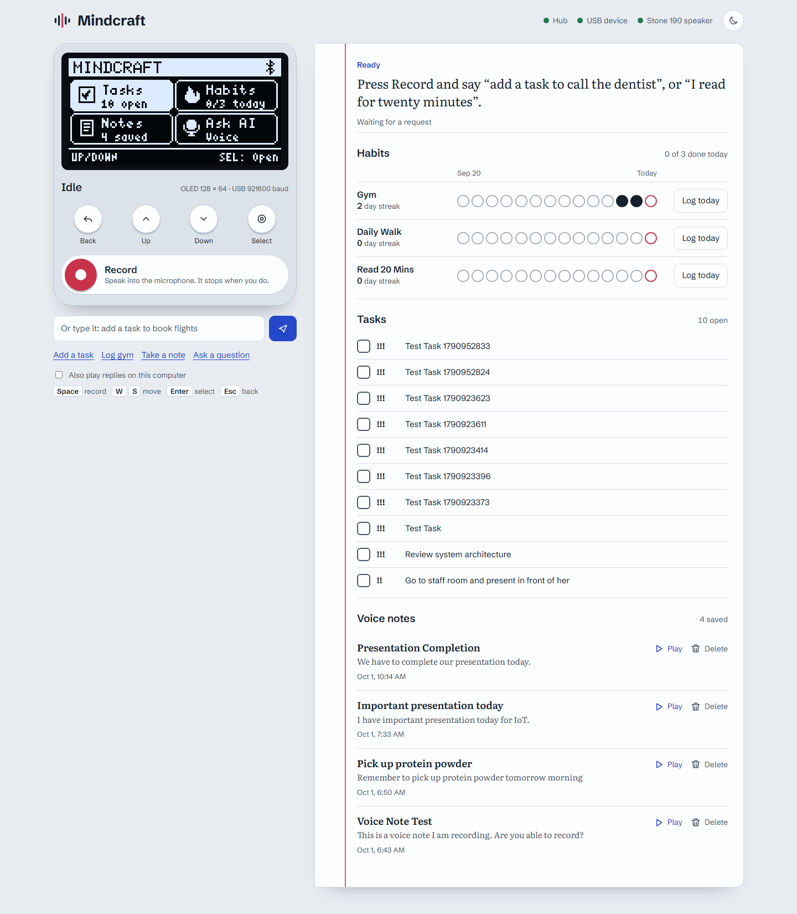

# Mindcraft

A voice notebook. Say "add a task to call the dentist" or "I went to the gym" to an ESP32 recorder; Gemini works
out what you meant, files it as a task, note or habit streak, and answers out loud on a Bluetooth speaker.



## What it is

- **ESP32** with a 128x64 OLED, an INMP441 microphone and optional push buttons. It starts recording when you
  speak and stops when you stop.
- **Bluetooth speaker** (boAt Stone 190) plays the replies.
- **Companion hub** on your PC (FastAPI + Gemini + text-to-speech) keeps the tasks, habits and notes.
- **USB bridge** carries everything between the PC and the ESP32. The ESP32 never uses Wi-Fi, because Wi-Fi and
  Bluetooth share one radio and Wi-Fi traffic made the speaker stutter.
- **Dashboard** at http://localhost:8000 with a live copy of the OLED, the device buttons, and your notebook.

```
INMP441 --I2S--> ESP32 --USB (921600 baud)--> serial_bridge.py --> Companion hub --> Gemini
OLED <--I2C----- ESP32 <--USB----------------  serial_bridge.py <-- Companion hub <-- text-to-speech
                 ESP32 --Bluetooth--> Stone 190 speaker
```

## Hardware

| Part | Pin | ESP32 |
| :--- | :--- | :--- |
| OLED SSD1306 (I2C 0x3C) | SDA / SCL | GPIO 21 / GPIO 22 |
| INMP441 microphone | SCK / WS / SD | GPIO 26 / GPIO 25 / GPIO 32 |
| | L/R, VDD, GND | GND, 3V3, GND |
| Buttons (optional, to GND) | Up / Down / Select / Back | GPIO 27 / 14 / 13 / 4 |

The speaker connects over Bluetooth, so it needs no wiring. Its Bluetooth name must be `Stone 190`. Pins and
the volume are set in [`firmware/src/config.h`](firmware/src/config.h).

## Set up and run

1. **Hub.** In `companion/`, create `.env` with `GEMINI_API_KEY=your_key`, then:
   ```powershell
   python -m venv .venv
   .venv\Scripts\activate
   pip install -r requirements.txt
   python -m uvicorn app:app --host 127.0.0.1 --port 8000
   ```
2. **Firmware.** In `firmware/` (needs PlatformIO), with the ESP32 on USB:
   ```powershell
   pio run -t upload --upload-port COM3
   ```
3. **Bridge.** In `companion/`, in a second window (only one program can use the COM port, so close it before
   flashing):
   ```powershell
   python serial_bridge.py --port COM3
   ```
4. Open http://localhost:8000. The three lights at the top (Hub, USB device, Stone 190 speaker) should be green.

If the dashboard says **No signal**, the bridge is not running or the ESP32 is not plugged in.

## Using it

Press **Record** (or Space, or the Select button on the "Ask AI" tile) and speak. Examples: "add a high priority
task to send the invoice", "I finished the invoice task", "note: ask the supplier about the power adapter",
"I read for twenty minutes", or any question. You can also type the request on the dashboard.

Keys: Space record, W/S or arrows move, Enter select, Esc back.

## Project layout

| Path | What is in it |
| :--- | :--- |
| `firmware/src/` | ESP32 code: `main.cpp` (USB protocol, buttons), `display.cpp` (OLED screens), `audio_mic.cpp` (voice capture), `audio_speaker.cpp` (Bluetooth playback) |
| `companion/app.py` | Hub: web server, websockets, screen state machine |
| `companion/screens.py` | The screens shown on the OLED and mirrored on the dashboard |
| `companion/storage.py` | SQLite tasks, notes and habit streaks |
| `companion/gemini_service.py`, `tts_service.py` | Gemini requests and text-to-speech |
| `companion/serial_bridge.py` | USB link between the PC and the ESP32 |
| `companion/web/index.html` | Dashboard |
| `docs/` | [Handoff notes](docs/mindcraft_handoff.md) (protocol, design decisions, limitations) and screenshots |
